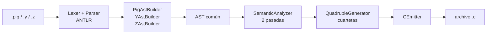
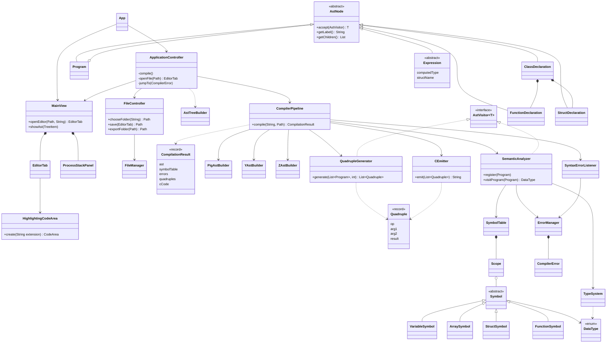

# contacto_3xtrat3rr3str3D

Compilador de PigLatin (`.pig`), Y? (`.y`) y Zetariano (`.z`) a código de tres direcciones (cuartetas) y de ahí a
C compilable, con un editor propio en JavaFX. Proyecto 1 de Organización de Lenguajes y Compiladores 2, Centro
Universitario de Occidente (CUNOC), segundo semestre 2026.

## Funcionalidades

- **Tres lenguajes de entrada** que producen el mismo AST: PigLatin (programa principal), Y? (estructuras y
  funciones, bloques por sangría) y Zetariano (clases y objetos al estilo Java).
- **Análisis léxico, sintáctico y semántico** con ANTLR4. Cada error muestra tipo, archivo, línea, columna, lexema
  y, cuando aplica, la corrección sugerida.
- **Imports** entre archivos: el `.pig` importa funciones y estructuras de `.y` y clases de `.z`; las clases se ven
  entre sí sin importarse.
- **Cuartetas → C**: el `.c` generado compila con `gcc -Wall` sin warnings. Stack y heap simulados, objetos y
  arreglos en el heap, recursividad, y un runtime que se detiene con un mensaje ante referencia nula, división
  entera entre cero o memoria agotada.
- **Editor**: árbol de la carpeta de trabajo (abrir, crear, guardar y descargar archivos y carpetas), pestañas,
  coloreado en tiempo real para los tres lenguajes con el lexer del propio compilador (sin librerías de coloreado),
  errores con salto al archivo, AST con `línea:columna` exportable a texto, tabla de símbolos, pila de procesos
  paso a paso, cuartetas y código C descargable.

## Stack tecnológico

| Tecnología | Versión | Uso |
|---|---|---|
| Java | 21 (`maven.compiler.release`; probado con JDK 26.0.2.1) | lenguaje del compilador |
| ANTLR | 4.13.2 (`antlr4-maven-plugin` + `antlr4-runtime`) | lexers y parsers de los 3 lenguajes, patrón visitor |
| JavaFX | 21.0.9 (`javafx-controls`) | interfaz gráfica |
| RichTextFX | 0.11.3 | área de código con estilos por rango |
| Maven | 3.9 (probado con 3.9.11) | construcción; `maven-compiler-plugin` 3.8.0, `javafx-maven-plugin` 0.0.8 |
| gcc | 13.3.0 (Ubuntu en WSL) | compilar el C generado |

## Requisitos

- JDK 21 o superior, con `JAVA_HOME` configurado.
- Maven 3.9 o superior.
- `gcc` para ejecutar el C generado. En Windows, dentro de WSL: `wsl --install` y luego `sudo apt install gcc`.

## Levantar el proyecto

```
git clone https://github.com/DiegoMaldonado19/contacto_3xtrat3rr3str3D.git
cd contacto_3xtrat3rr3str3D
mvn clean javafx:run
```

Maven genera los parsers de ANTLR durante la compilación: no hay pasos manuales. `mvn clean compile` solo compila.
En NetBeans basta abrir la carpeta como proyecto Maven y ejecutar *Run* (`nbactions.xml` usa `javafx:run`).

## Uso rápido

1. **Abrir carpeta** → `examples/pila`, y doble clic en `main.pig`.
2. **Compilar**. La barra inferior muestra el resultado; las pestañas de la derecha, errores, AST, tabla de
   símbolos, pila de procesos, cuartetas y código C.
3. **Descargar .c** guarda `main.c` junto al `.pig`. Para ejecutarlo:

```
gcc main.c -o main && ./main                      # Linux / macOS
wsl -e gcc main.c -o main && wsl -e ./main        # Windows
```

Entrada de ejemplo para `examples/pila`, un valor por línea: `1 5 x 1 7 x 3 x 2 x 3 x 4 x`. Imprime la pila `7, 5`,
desapila `7` y luego imprime `5`.

## Arquitectura

Los tres lenguajes producen **el mismo AST**, así el análisis semántico, las cuartetas y el C se escriben una sola
vez:



- **MVC**: `view` (JavaFX) no conoce ANTLR; `model` no conoce JavaFX; `controller` los une.
- `CompilerPipeline` resuelve los `import`, compila cada archivo con su front-end y corre el semántico en dos
  pasadas sobre todos los archivos: primero registra estructuras, clases y firmas, después valida cuerpos.
- Corta solo por errores léxicos: tras un error sintáctico sigue, para reportar también los semánticos. Solo un
  `.pig` sin errores genera cuartetas y C.

| Paquete | Responsabilidad |
|---|---|
| `model` | `CompilerPipeline`: orquesta el pipeline y devuelve un `CompilationResult` |
| `model.analysis` | parse tree → AST (`PigAstBuilder`, `YAstBuilder`, `ZAstBuilder`) y validación (`SemanticAnalyzer`) |
| `model.ast` | AST común: `AstNode`, `AstVisitor<T>` y 38 nodos |
| `model.symbols`, `model.types` | tabla de símbolos, ámbitos, sobrecarga; tipos y compatibilidad |
| `model.codegen` | `QuadrupleGenerator`, `Quadruple`, `CEmitter` |
| `model.errors`, `model.stack` | errores léxicos, sintácticos y semánticos; pila de procesos del parser |
| `view`, `controller`, `util` | interfaz, eventos, archivos y carpetas |

<details>
<summary>Diagrama de clases (fuente Mermaid)</summary>



</details>

### Estructura del repositorio

```
contacto_3xtrat3rr3str3D/
├── docs/                       manuales de usuario y técnico (.docx)
├── examples/                   programas listos para compilar
├── src/main/antlr4/.../grammar lexers y parsers: Pig*, Y*, Z* (.g4)
├── src/main/java/.../          App + controller, model, view, util
├── src/main/resources/         contacto.css
└── pom.xml
```

## Patrones de diseño

| Patrón | Dónde | Para qué |
|---|---|---|
| MVC | `view`, `model`, `controller` | la interfaz y el compilador cambian por separado |
| Visitor | `AstVisitor<T>`, implementado por `SemanticAnalyzer` (devuelve `DataType`) y `QuadrupleGenerator` (devuelve el operando: un temporal o una constante); los `*AstBuilder` extienden los visitors que genera ANTLR | recorrer el mismo AST con operaciones distintas sin tocar los nodos |
| Composite | `AstNode` y sus hijos (`Program`, `ClassDeclaration`, `Block`, ...) | tratar el árbol de forma uniforme: análisis, AST visual y exportación |
| Pipeline | `CompilerPipeline`: parser → AST → semántico → cuartetas → C | etapas independientes que se detienen ante errores |
| Observer | `SyntaxErrorListener` (`BaseErrorListener`), `ProcessStackListener` (`ParseTreeListener`), eventos de JavaFX | recibir errores y pasos del parser sin acoplarse a ANTLR |
| Método de fábrica estático | `HighlightingCodeArea.create(extension)` | crear el editor con el lexer que corresponde a la extensión |
| DTO inmutable (`record`) | `CompilationResult`, `Quadruple`, `ProcessStep` | llevar el resultado del modelo a la vista |

## Lenguajes

| Lenguaje | Extensión | Rol | Estilo |
|---|---|---|---|
| PigLatin | `.pig` | programa principal (`MAIOR>`), variables globales e imports | palabras en latín, bloques `{ } finis;` |
| Y? | `.y` | estructuras y funciones | tipo Python, bloques por sangría |
| Zetariano | `.z` | clases; los objetos viven en el heap | tipo Java |

## Ejemplos (`examples/`)

| Carpeta / archivo | Qué muestra |
|---|---|
| `pila/` | la prueba de la auxiliar ya corregida: objetos `.z` y una función `.y` |
| `objetos/` | todos los ejemplos del enunciado de Zetariano |
| `matrices/` | matrices en PigLatin y Y?, con los literales confirmados por la auxiliar |
| `resistencia.pig`, `enunciado.pig` | PigLatin + Y?: funciones, recursividad, arreglos, estructuras, ciclos |

Cada `main.pig` indica en su encabezado la entrada de ejemplo y la salida esperada.

## Manuales

- [Manual de usuario](docs/MANUAL_USUARIO.docx): arranque, ventana, archivos y carpetas, compilar, leer errores,
  resultados y ejecución del C.
- [Manual técnico](docs/MANUAL_TECNICO.docx): tecnologías, arquitectura, diagrama de clases, palabras reservadas y
  símbolos, gramáticas, tabla de compatibilidad de tipos, modelo de memoria, cuartetas, errores, pruebas y
  limitaciones conocidas.

## Autor

Diego José Maldonado Monterroso · Carné 201931811 · CUNOC, 2026.
